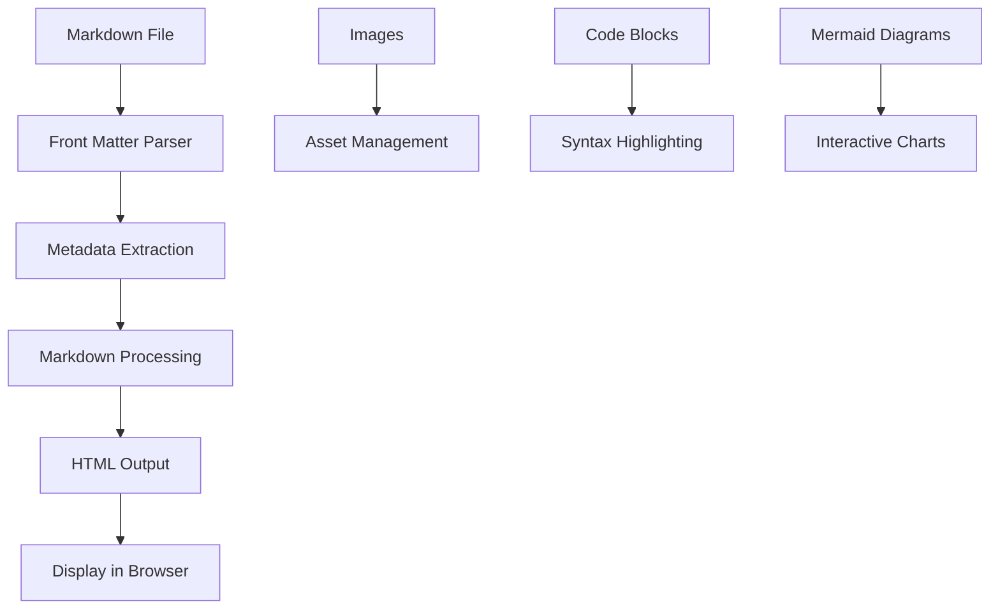

# Building a Markdown Blog with Laravel

In this article, I'll walk you through how to build a powerful markdown-based blog system using Laravel and the excellent Spatie Markdown package. This approach gives you the flexibility of writing content in markdown while leveraging Laravel's robust framework.

## Why Markdown for Blogging?

Markdown has become the de facto standard for technical writing because it's:

- **Simple to write** - Focus on content, not formatting
- **Version control friendly** - Easy to track changes in Git
- **Portable** - Can be converted to HTML, PDF, or other formats
- **Developer-friendly** - Familiar syntax for technical writers

## Setting Up the Foundation

### 1. Install Required Packages

```bash
composer require spatie/laravel-markdown
```

### 2. Create the Content Structure

```bash
mkdir -p content/articles content/projects
```

This creates a clean separation between your application code and content.

### 3. Build the Markdown Service

The heart of our system is a service that handles:

- Reading markdown files from the filesystem
- Extracting front matter metadata
- Converting markdown to HTML
- Managing article relationships

## Front Matter Metadata

Each markdown file starts with YAML front matter that defines the article's metadata:

```yaml
---
title: Your Article Title
description: A brief description for SEO
date: 2024-01-15
tags: [Laravel, PHP, Web Development]
image: article-image.jpg
---
```

## Code Highlighting

The Spatie Markdown package includes excellent code highlighting support:

```php
<?php

namespace App\Services;

use Spatie\LaravelMarkdown\MarkdownRenderer;

class MarkdownService
{
    public function __construct(MarkdownRenderer $markdownRenderer)
    {
        $this->markdownRenderer = $markdownRenderer;
    }
    
    public function getArticle(string $slug): ?array
    {
        // Implementation here
    }
}
```

## Mermaid Diagrams

One of the most powerful features is the ability to include Mermaid diagrams directly in your markdown:



## Image Support

Images are handled seamlessly:


You can also use relative paths and the system will automatically resolve them to the correct asset location.

## Search and Filtering

The system includes powerful search and filtering capabilities:

- **Full-text search** across titles, descriptions, and content
- **Tag-based filtering** to find related articles
- **Date-based sorting** for chronological organization

## Performance Considerations

Since we're reading from the filesystem, we implement several optimizations:

1. **Caching** - Cache processed markdown to avoid repeated parsing
2. **Lazy Loading** - Only load full content when viewing individual articles
3. **Indexing** - Build search indexes for faster queries

## Deployment Workflow

The beauty of this system is its simplicity:

1. Write articles in markdown
2. Commit to Git repository
3. Deploy - articles are automatically available
4. No database migrations or complex content management

## Conclusion

This markdown-based blog system provides:

- **Developer-friendly content creation**
- **Version-controlled content management**
- **Excellent performance and scalability**
- **Rich formatting with code highlighting and diagrams**

The combination of Laravel's robust framework with markdown's simplicity creates a powerful platform for technical blogging that scales with your needs.

---

*This article demonstrates the capabilities of the markdown blog system we've built. You can now write articles in markdown, add them to your Git repository, and they'll automatically appear on your website with full formatting, syntax highlighting, and interactive diagrams.*
